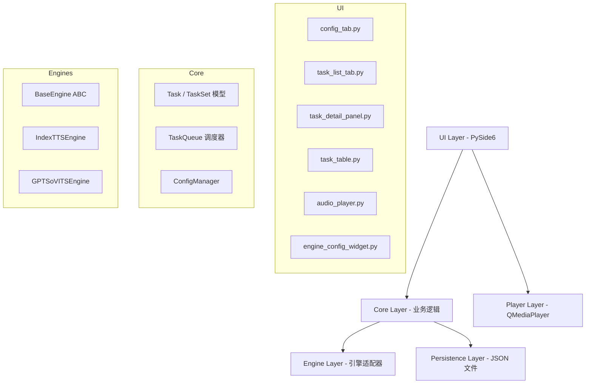
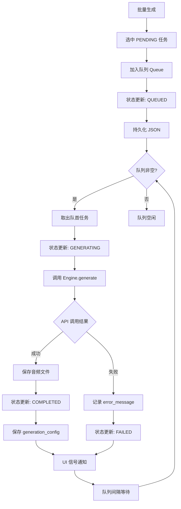
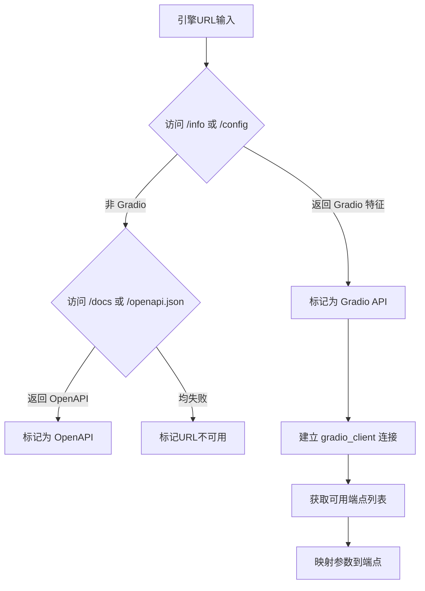

## 项目概述

IndexTTS-GUI2 是一款桌面端 AI 语音合成任务管理工具，解决视频创作者在使用多个 TTS 引擎（IndexTTS、GPT-SoVITS 等）时面临的手动操作繁琐、文件管理混乱、多平台切换低效等痛点。

## 核心功能需求

### 任务集管理

- 任务集对应一个项目目录，目录内存储所有任务配置（tasks/*.json）和输出音频（outputs/）
- 支持创建、切换、删除任务集

### 任务管理

- 任务状态机：未开始 → 队列中 → 生成中 → 生成完成 / 生成失败，支持重新生成
- 任务列表：表格展示（ID、文案摘要、引擎、状态颜色标识）、排序、多选批量操作（批量生成/删除/下载）
- 任务详情：左右分栏布局，左侧列表，右侧详情面板（文案编辑、引擎选择、引擎专属参数配置）

### 任务队列调度

- 内部维护串行任务队列，批量生成后任务入队自动调度
- 队首调用引擎 API 生成，完成后自动出队处理下一个
- 队列中/生成中任务不可编辑

### 引擎配置

- 支持多引擎 URL 配置与连接测试
- IndexTTS：参考音频、目标文案、情感模式（与参考音频相同/上传情感参考音频/情感向量指定），情感向量含 8 个 0~1 滑块 + 控制权重
- GPT-SoVITS：预留适配器框架，待后续对接细化
- 引擎采用插件/适配器模式，新增引擎只需实现统一接口

### 全局播放器

- 顶部固定播放栏，全局单例
- 支持播放生成音频和参考音频
- 支持暂停，新播放自动停止旧播放

### 持久化

- JSON 文件持久化，任务配置保存在任务集目录
- 生成完成时保存 generation_config 快照，便于复现
- 文件命名规范：`{task_id}_{sanitized_text}.{ext}`

### UI 布局

- 横版 Tab 栏位于内容区域上方（配置 Tab / 任务列表 Tab）
- 配置 Tab：引擎 URL 配置卡片 + 任务集管理卡片 + 全局设置卡片
- 任务 Tab：左右分栏（左列表 + 右详情面板）
- Material Design 风格，状态颜色标识（灰/蓝/橙/绿/红）

## 技术栈

| 技术 | 选型 | 说明 |
| --- | --- | --- |
| 语言 | Python 3.11+ | 稳定版本，生态丰富 |
| GUI 框架 | PySide6 | Qt for Python，原生表格/媒体播放/Tab 切换 |
| 环境管理 | uv | 快速依赖管理，生成 lock 文件，方便迁移 |
| 音频播放 | QMediaPlayer (PySide6 内置) | 无需额外依赖，支持播放/暂停 |
| HTTP 客户端 | httpx | 异步支持，用于调用引擎 WebUI API |
| Gradio API 客户端 | gradio_client | 官方 Python 客户端，直接调用 Gradio 端点 |
| JSON 处理 | orjson 或标准库 json | 高性能 JSON 序列化 |
| 持久化 | JSON 文件 | 轻量，适合任务级配置 |
| 文件管理 | pathlib | 跨平台路径处理 |
| 打包分发 | PyInstaller | 生成独立 exe 可执行文件 |


## 项目目录结构

```
indextts-gui2/
├── pyproject.toml                 # uv 项目配置与依赖声明
├── uv.lock                        # uv 依赖锁定文件
├── build_exe.py                   # PyInstaller 打包脚本
├── build_exe.spec                 # PyInstaller spec 配置
├── README.md
├── requirements.md                # 需求文档（已存在）
├── src/
│   ├── __init__.py
│   ├── main.py                    # 应用入口，单实例检查
│   ├── app.py                     # 主窗口（QMainWindow），Tab框架 + 全局播放器
│   ├── resources/
│   │   ├── __init__.py
│   │   └── style.qss             # Material Design QSS 样式表
│   ├── ui/
│   │   ├── __init__.py
│   │   ├── config_tab.py          # 配置 Tab 页（引擎配置 + 任务集管理 + 全局设置）
│   │   ├── task_list_tab.py       # 任务列表 Tab 页（左右分栏容器）
│   │   ├── task_detail_panel.py   # 任务详情右侧面板
│   │   ├── task_table.py          # 任务列表左侧表格（QTableWidget）
│   │   ├── audio_player.py        # 全局音频播放器组件（QMediaPlayer）
│   │   └── engine_config_widget.py # 引擎配置动态表单（情感模式切换）
│   ├── core/
│   │   ├── __init__.py
│   │   ├── task.py                # Task 数据类 + TaskStatus 枚举 + 状态机验证
│   │   ├── taskset.py             # TaskSet 数据类 + 目录扫描/加载
│   │   ├── task_queue.py          # 任务队列调度器（QThread + Queue）
│   │   └── config_manager.py      # 应用全局配置读写（QSettings + JSON）
│   ├── engines/
│   │   ├── __init__.py            # 引擎注册表（EngineRegistry）
│   │   ├── base_engine.py         # 引擎抽象基类（接口定义）
│   │   ├── indextts_engine.py     # IndexTTS Gradio 适配器
│   │   └── gpt_sovits_engine.py   # GPT-SoVITS 适配器（预留框架）
│   └── utils/
│       ├── __init__.py
│       ├── file_utils.py          # 文件命名 sanitize + 路径处理
│       └── api_detector.py        # Gradio API 类型探测与连接测试
└── tests/
    ├── __init__.py
    ├── test_task.py               # Task 模型单元测试
    ├── test_taskset.py            # TaskSet 加载/保存测试
    ├── test_queue.py              # 任务队列调度测试
    ├── test_file_utils.py         # 文件命名规范测试
    └── test_engine.py             # 引擎适配器测试
```

## 核心架构设计

### 分层架构



### 数据模型

```python
from enum import Enum
from dataclasses import dataclass, field, asdict
from pathlib import Path
from typing import Optional

class TaskStatus(str, Enum):
    PENDING = "未开始"
    QUEUED = "队列中"
    GENERATING = "生成中"
    COMPLETED = "生成完成"
    FAILED = "生成失败"

@dataclass
class Task:
    id: str                         # 短ID，如 "task_001"
    text: str                       # 目标文案
    engine: str                     # 引擎标识符
    status: TaskStatus = TaskStatus.PENDING
    engine_params: dict = field(default_factory=dict)
    output_audio_path: Optional[str] = None
    generation_config: Optional[dict] = None
    error_message: Optional[str] = None
    created_at: str = ""
    updated_at: str = ""

@dataclass
class TaskSet:
    id: str
    name: str
    directory: Path
    tasks: list[Task] = field(default_factory=list)
    created_at: str = ""
    updated_at: str = ""
```

### 引擎抽象接口

```python
from abc import ABC, abstractmethod

class BaseEngine(ABC):
    engine_id: str = ""
    engine_name: str = ""
    
    @abstractmethod
    async def test_connection(self, url: str) -> bool: ...
    
    @abstractmethod
    async def generate(self, url: str, params: dict) -> bytes: ...
    
    @abstractmethod
    def get_param_schema(self) -> dict: ...
    
    @abstractmethod
    def validate_params(self, params: dict) -> list[str]: ...
```

### 任务队列调度流程



### API 探测策略



### 信号/槽通信机制

采用 PySide6 Signal/Slot 实现模块间解耦：

- `TaskQueue.generation_started(task_id)` → UI 更新状态行
- `TaskQueue.generation_completed(task_id, audio_path)` → UI 刷新 + 播放器可用
- `TaskQueue.generation_failed(task_id, error)` → UI 显示错误
- `AudioPlayer.play_requested(file_path)` → 停止旧音频，播放新音频

## 实现细节

### 性能与稳定性

- 任务队列使用 `QThread` + `queue.Queue`，避免阻塞 GUI 主线程
- HTTP 请求使用 `httpx` 异步客户端，设置超时（默认 120s）
- 队列间隔可配置（默认 2 秒），避免 API 限流
- 所有文件 IO 操作使用 `pathlib`，自动处理路径分隔符
- JSON 读写使用原子写入（先写临时文件，再 rename），防止写入中断损坏数据

### 打包策略

- 使用 PyInstaller 配套 spec 文件，显式声明 `--hidden-import`（PySide6 子模块、gradio_client）
- 静态资源（style.qss）通过 `--add-data` 打包进 exe
- 使用 `sys._MEIPASS` 在运行时正确访问打包后资源路径
- uv 锁定依赖版本，确保打包可重现

### 错误处理

- 引擎 API 调用异常捕获后标记 FAILED，error_message 存储详细错误
- 队列中未完成的任务应用关闭时提示用户
- 文件写入失败时重试 3 次，仍失败则通知用户
- QMediaPlayer 播放异常静默降级（提示音频不可用）

## 设计风格

采用 **Material Design 3** 风格，通过 PySide6 QSS 样式表实现。整体以暗色主题为主，辅以 Material 核心颜色系统，带来专业且现代的视觉体验。

## 全局框架布局

- 顶部：全局播放器栏，深色背景，包含播放/暂停按钮、播放进度条、当前播放文件名
- 播放器下方：横版 Tab 栏（Material Tab 风格），选中 Tab 有底部指示器和颜色高亮
- Tab 下方：内容区域，使用 QStackedWidget 切换配置 Tab 和任务 Tab

## 配置 Tab 页面

三个 GroupBox 卡片，带 Material 阴影和圆角：

- 引擎配置卡片：每个引擎独立行，URL 输入框 + 测试连接按钮 + 连接状态指示灯（绿色圆点 = 已连接，红色圆点 = 未连接）
- 任务集管理卡片：当前路径显示 + 浏览按钮 + 历史任务集列表（带文件夹图标和日期）
- 全局设置卡片：下拉框/输入框组合，保存按钮使用 Material 主色

## 任务 Tab 页面（左右分栏）

- 左侧任务列表（占 40%）：顶部批量操作工具栏（按钮组），下方 QTableWidget 表格，表头支持排序，每行含 checkbox、任务ID、文案摘要、引擎标签、状态标识（彩色圆点+文字）
- 右侧任务详情（占 60%）：上方文案多行文本框，中部引擎下拉选择器，下方动态引擎参数配置区（根据选中引擎切换），底部状态指示 + 操作按钮组（保存/下载/删除）

## 状态颜色系统

- 未开始：灰色 #9E9E9E
- 队列中：蓝色 #2196F3
- 生成中：橙色 #FF9800（带脉冲动画）
- 生成完成：绿色 #4CAF50
- 生成失败：红色 #F44336

## 交互细节

- 引擎参数区根据引擎类型和情感模式动态渲染（隐藏/显示滑块组）
- 情感向量滑块范围 0.00~1.00，步长 0.01，带数值标签
- 批量操作需先勾选任务，按钮在无选中时置灰
- 队列中/生成中的任务详情面板进入只读模式

## Agent Extensions

### Skill

- **find-skills**
- Purpose: 在开发过程中如遇到需要额外工具支持的需求（如 Gradio API 分析、打包问题排查），用于查找可安装的技能扩展
- Expected outcome: 发现并建议安装适合当前开发任务的技能工具